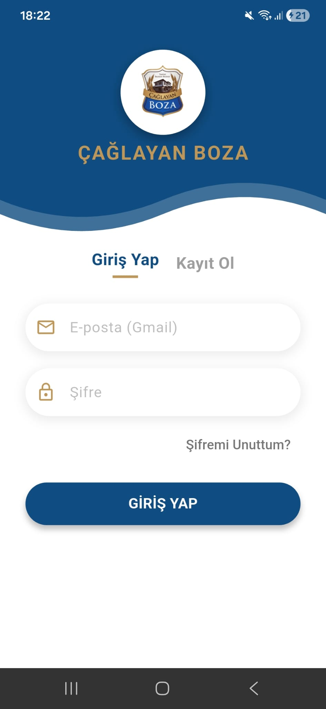
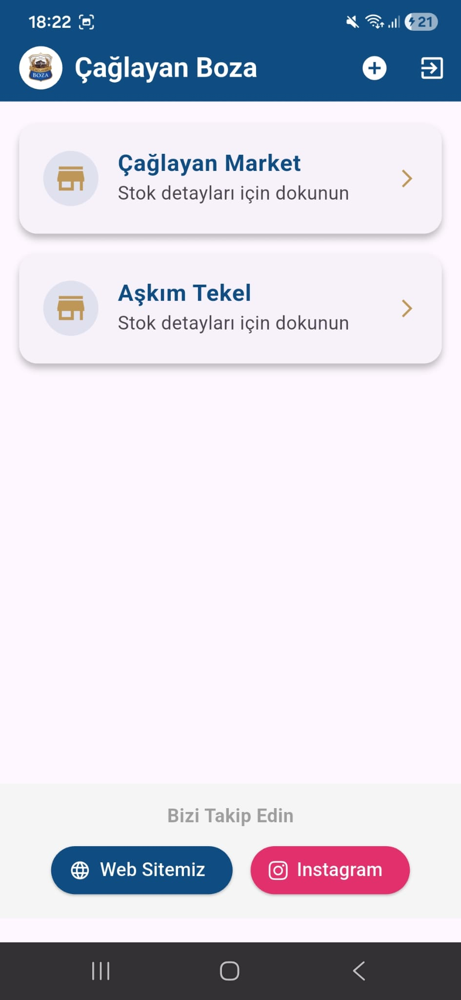
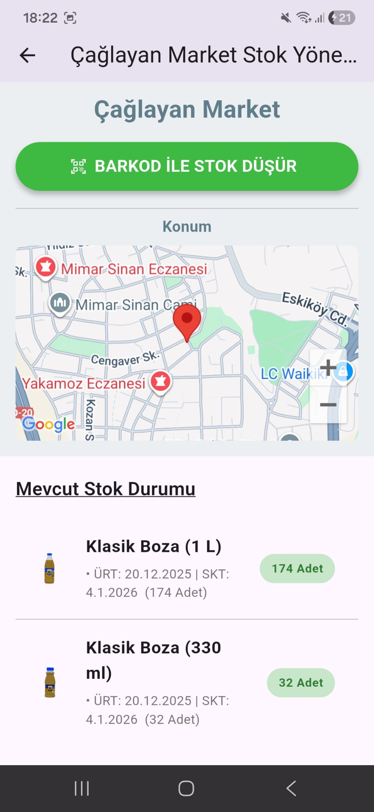
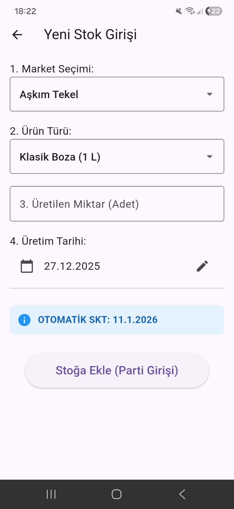

# Çağlayan Boza Mobil Stok Takip Sistemi 🥤📱

**Ders:** Mobil Programlama / Final Projesi
**Geliştirici:** [Arda Karamemiş]
**Okul No:** [24380101017]

## 🚀 Proje Hakkında
Bu proje, **Çağlayan Boza** işletmesinin stok takibini dijitalleştirmek, anlık stok durumunu izlemek ve kritik stok seviyelerinde ilgili personelleri uyarmak amacıyla geliştirilmiş bir mobil uygulamadır.

Modern **Flutter** mimarisi (Clean Architecture prensipleri) kullanılarak geliştirilmiş ve **Firebase** (Firestore, Auth) bulut tabanlı servisleriyle entegre edilmiştir.

## ✨ Temel Özellikler (Functionality)
*   **🔐 Güvenli Giriş & Yetkilendirme:** Personel ve Yönetici rolleri ayrıştırılmıştır. (Firebase Auth)
*   **📦 Anlık Stok Takibi:** Market bazlı stok görüntüleme (Batch/Parti takibi).
*   **🔔 Bildirim Sistemi:** Stok azaldığında veya yeni üretim girildiğinde otomatik bildirimler.
*   **📷 Barkod ile Stok Düşümü:** Kamera entegrasyonu ile hızlı satış/stok çıkışı.
*   **📍 Konum Bazlı Servisler:** Marketlerin harita üzerindeki konumları (Google Maps).
*   **📱 Responsive Tasarım:** Hem dikey hem yatay kullanım için optimize edilmiş arayüz.

## 🛠️ Kullanılan Teknolojiler (Technical Competence)
*   **Dil:** Dart
*   **Framework:** Flutter (3.x)
*   **Backend:** Firebase (Cloud Firestore, Authentication)
*   **State Management:** Native (`setState`, `StreamBuilder` - Reactive Programming)
*   **Diğer Paketler:**
    *   `mobile_scanner` (Barkod okuma)
    *   `google_maps_flutter` (Harita)
    *   `flutter_local_notifications` (Bildirimler)

## 📸 Ekran Görüntüleri (Screenshots)

| Giriş Ekranı | Ana Ekran | Stok Detay |
|--------------|-----------|------------|
|  |  |  |  |

## 🏗️ Proje Mimarisi (Code Quality)
Proje, okunabilirliği ve bakımı kolaylaştırmak için aşağıdaki klasör yapısına ayrılmıştır:

*   `lib/models/`: Veri modelleri ve sınıflar (OOP).
*   `lib/screens/`: Kullanıcı arayüzü ve sayfalar.
*   `lib/services/`: Veritabanı ve dış servis bağlantıları (Service Pattern).

## 🚀 Kurulum
1.  Depoyu klonlayın: `git clone https://github.com/KULLANICI_ADINIZ/REPO_ADINIZ.git`
2.  Bağımlılıkları yükleyin: `flutter pub get`
3.  Uygulamayı başlatın: `flutter run`

---
Copyright © 2025 Çağlayan Boza Mobil
